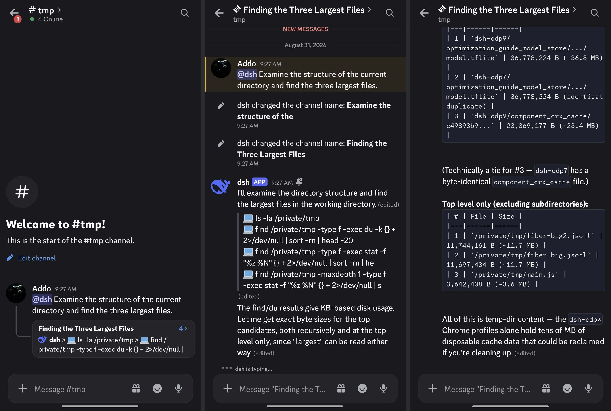
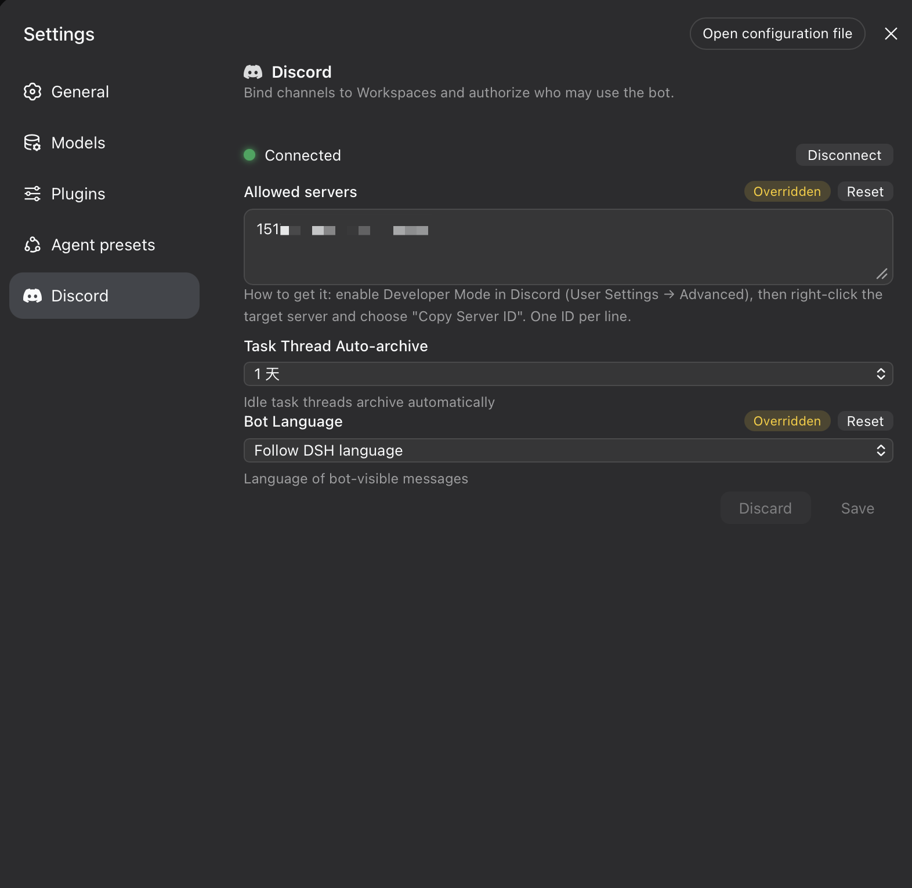

# @addozhang/dsh-discord

[English](README.md) | [中文](README.zh.md)

[](https://www.npmjs.com/package/@addozhang/dsh-discord)
[](https://github.com/addozhang/dsh-discord/actions/workflows/ci.yml)
[](./LICENSE)
[](./package.json)
[](https://dshfind.com/en/plugins/addozhang/dsh-discord?ref=badge)

A Discord-first adapter for [DeepSeek Harness](https://github.com/deepseek-ai): run DSH sessions from your Discord guild — mention the bot with a task, a thread opens, the answer streams in, and approvals and questions arrive as buttons you can answer from your phone.

No extra process: the adapter is a DSH plugin that mounts straight onto your `dsh web` profile. Session state stays in DSH; durable bindings live in the profile's storage domain.

<p align="center">
  
</p>

## Features

- **Mention-driven sessions** — an authorized `@bot <task>` in a bound channel anchors a thread (your message becomes the first post), creates the DSH session, and submits the prompt at most once. Follow-ups inside the thread queue without a mention. Attached images ride along: they are downloaded from the Discord CDN within strict size/host bounds and submitted as image parts for multimodal models.
- **Stream rendering** — typing indicator, one head message edited in place, per-tool activity rows, fenced long-answer splitting, one-time finalize; the activity message is deleted when the turn ends.
- **Approvals & questions** — DSH ask frames become buttons, select menus, and a free-text modal. Ownership is enforced (the asker — or the thread owner on later turns — clicks), expiry sweeps fail closed, and settled controls grey out in place.
- **Session control** — `/steer`, `/stop`, and `/queue list|remove` with turn-ownership checks; `/project bind|list|info` and `/session resume` for guild↔workspace binding and history; `/guild forget` for operator cleanup.
- **Model selection** — `/model show` reads the session's live model directory; `/model select` walks an interactive provider → model → reasoning cascade, or applies a typed `provider/model` directly. Open to any authorized member by default; restrictable to Host operators.
- **Settings card, bilingual out of the box** — token onboarding and connect/disconnect (stored in the Host credential service, never in settings or logs), guild allowlist, auto-archive, and language. Every Discord-visible string ships in Chinese and English; the bot follows the DSH language preference or a pinned choice.
- **Hardened by design** — deny-first authorization inside an explicit guild allowlist. Mentions are suppressed twice: `allowed_mentions` on every request, plus byte-level neutralization of the wire body. DSH submission is at-most-once with unknown-preserving reconciliation — an ambiguous delivery is never blindly resent. Bindings survive restarts, and the READY sweep rebuilds deleted category/control channels while treating a deleted workspace channel as user intent (the mapping retires; the workspace stays bindable).

## Requirements

- The [dsh CLI](https://www.npmjs.com/package/@deepseek-ai/dsh) `0.1.1-rc.2` or newer, running a web profile
- Node.js `^22.19.0 || >=24`
- A Discord application with a bot user and the **MESSAGE CONTENT** privileged intent enabled (Developer Portal → your application → Bot → Privileged Gateway Intents)

## Install

Install with the dsh CLI — it installs the package into the profile and registers the bundle for you:

```sh
dsh plugin --profile web add @addozhang/dsh-discord
```

Then restart `dsh web` and refresh the browser. `dsh plugin` reconciles the profile's bundle list for you — nothing to edit by hand.

Upgrade and removal use the same command:

```sh
dsh plugin --profile web up @addozhang/dsh-discord   # upgrade; the bundle list reconciles again
dsh plugin --profile web rm @addozhang/dsh-discord   # remove; run /guild forget first to clean adapter records
```

If you manage a profile without the CLI, the manual equivalent is to add the package with pnpm inside the profile directory and list it in `dsh.profile.bundles` yourself:

```json
{
  "dsh": { "profile": { "bundles": ["@deepseek-ai/dsh-base", "@deepseek-ai/dsh-web-app", "@addozhang/dsh-discord"] } }
}
```

## Configuration

All keys live in the `dsh-discord` settings namespace and can be set either from the settings card or by editing the profile's user settings (`settings.yaml`):

| Key | Default | Meaning |
|---|---|---|
| `enabled` | `false` | Adapter master switch; the card's Connect starts it once a token is stored. |
| `allowedGuildIds` | `[]` | Guild allowlist. Anything outside is ignored with zero adapter or DSH calls. |
| `memberUserIds` / `memberRoleIds` | `[]` | Member-level authorization inside an allowed guild. |
| `administratorUserIds` / `administratorRoleIds` | `[]` | Workspace-administrator level (`/project bind`). |
| `deniedUserIds` / `deniedRoleIds` | `[]` | Deny entries; they win over every grant above. |
| `hostOperatorUserIds` | `[]` | Host operators (`/guild forget`; `/model select` when `modelSelectOperatorOnly` is enabled). |
| `modelSelectOperatorOnly` | `false` | Restrict `/model select` to Host operators (`settings.yaml` only; the card does not expose it). Default `false`: any authorized member may switch, and the switch still updates the Host default. |
| `defaultVerbosity` | `essential-tools` | Tool-activity row granularity: `text-only`, `essential-tools`, or `full-tools`. |
| `language` | `auto` | Bot-visible copy language: `auto` follows the DSH language preference (non-Chinese renders English), or pin `zh`/`en`. |
| `streamUpdateIntervalMs` | `800` | Coalescing budget for stream edits (250–10000). |
| `typingIntervalMs` | `7000` | Typing-indicator heartbeat (1000–30000). |
| `approvalTimeoutMs` | `600000` | Approval ask deadline (30000–86400000); overdue asks auto-reject. |
| `questionTimeoutMs` | `1800000` | Question ask deadline (30000–86400000); expiry cancels the owning turn. |
| `threadAutoArchiveMinutes` | `1440` | Task-thread auto-archive: 60, 1440, 4320, or 10080. |

```yaml
dsh-discord:
  allowedGuildIds: ["1517134847850709032"]
  language: auto
```

The settings card exposes the three high-frequency fields (guild allowlist, auto-archive, language) plus the connection and token surface; every other key is fully supported through `settings.yaml`. An invalid stored section preserves the last known-good configuration.

<p align="center">
  
</p>

## Setup

1. Invite the bot to your guild with at least: View Channels, **Manage Channels** (the adapter provisions its category and workspace home channels), Send Messages, Create Public Threads, Send Messages in Threads, Attach Files, Read Message History.
2. Boot the profile and open the web UI.
3. In **Settings → Discord**, paste the bot token (Developer Portal → your application → Bot → Reset Token) and press **Connect**. The token is stored by the Host credential service — never in settings, logs, or the client.
4. Fill in **Allowed servers** (server IDs via Discord's Developer Mode → right-click a server → Copy Server ID). Everything outside this allowlist is ignored.
5. `/model select` works for any authorized member by default (single-user deployments). To restrict it to Host operators, add their IDs under `hostOperatorUserIds` and set `modelSelectOperatorOnly: true` in `settings.yaml`. `/guild forget` always requires a Host operator.
6. Pick the bot language and mention the bot in a bound channel to start a session.

## Commands

| Command | Where | What |
|---|---|---|
| `/project bind` | any channel | bind the guild to a workspace (admin; provisions the home channel) |
| `/project list` / `info` | any channel | list workspaces / inspect this channel's binding |
| `/queue list`, `/queue remove` | session thread | inspect and trim the pending queue |
| `/steer`, `/stop` | session thread | steer or cancel the running turn (owner only) |
| `/model show` / `select` | session thread | show the live model directory; `select` without arguments walks the interactive provider → model → reasoning cascade (any authorized member by default) |
| `/session resume` | project channel | pick one of this workspace's past sessions (autocomplete: title and age, newest first) and resume it into a new thread of this channel; blank, already-bound, subagent, and archived sessions are never offered |
| `/guild forget` | any channel | operator-only removal of adapter records |

## Design notes

- The adapter is a function/namespace plugin (`inject: ['apiProxy', 'credentials', 'settings', 'storageDomain', 'connection']`) that mounts the Discord Gateway, command surface, stream renderer, and the settings card onto the DSH web profile.
- The settings card is the first-run onboarding surface: the token entry writes the credential service's `DSH_DISCORD_BOT_TOKEN` ref over the plugin management channel, then triggers the start chain. Disconnect keeps the credential; an empty reconnect uses it.
- The publish workflow authenticates to npm via trusted publishing (OIDC) — no publish token is stored anywhere.
- The adapter start chain is generation-counted, so Connect/Disconnect races with the initial boot yield exactly one gateway.
- A credential probe falls back to `resolve()` because the Host's `describe()` misses env-sourced values — a connected adapter never reads as unconfigured.
- Adapter logging is default-quiet: flow records ride the Host's debug level and failure-shaped events escalate to warn — nothing prints into the DSH process at the default level.
- Wire-level live-path tracing: set `DSH_DISCORD_TRACE=1` before booting to emit mux frames, drop points, and delivery outcomes to stderr (default silent). It exists because the rc.2 Host wires no plugin log exporter and exposes no log-level switch — `logger.debug` output is unobservable — and should be dropped once the Host grows one.

## Known Limitations and Deferred Work

- **`/preset`, `/skill`, and `/host` stay deregistered** — their control modules are implemented and unit-tested and return when the router wires them (the `/preset` thread-context guard rides along).
- **Verbosity is a single global setting** (the DSH ecosystem has per-channel precedent).
- **Deferred after a Kimaki parity pass**: reconcile-interactions wiring, typing pause during ask waits, fail-closed binding/session-owner store wiring, and credential-rotation watching.
- **Known tension**: the 250ms minimum stream-edit interval against Discord's edit budget under heavy load (429s self-heal), and typing has no duration-capped watchdog.

## Development

```sh
pnpm install --ignore-scripts
pnpm test          # 683 tests incl. gateway/REST twin E2E
pnpm typecheck
pnpm lint
pnpm build         # lib + client bundle
```

To try a local build in a profile:

```sh
pnpm pack --pack-destination /tmp
dsh plugin --profile <your-profile> add file:/tmp/addozhang-dsh-discord-<version>.tgz
```

`dsh plugin` anchors relative path specs to the invoking directory, so from a checkout that has run `pnpm build`, `dsh plugin --profile <your-profile> add ../fiber` works too. Re-run pack + add to refresh the installed copy, then restart `dsh web`.

Releases are tagged (`npm version <level> && git push --follow-tags`) and published by [GitHub Actions](./.github/workflows/publish.yml) via npm trusted publishing (OIDC) — no publish token is stored anywhere. The implementation follows the OpenSpec change at `openspec/changes/build-discord-native-adapter/` (design, capability specs, verification checklist, review reports).

## License

MIT
